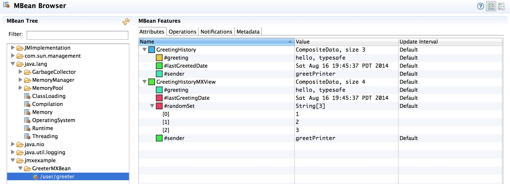

# Akka JMX Example

This is an example of how to integrate JMX into your Akka Actors.  Using this method, you can look inside a running Akka application and see exactly what sort of state your actors are in.  Thanks to [Jamie Allen](http://shinolajla.tumblr.com/) for the idea in his book, _[Effective Akka](http://smile.amazon.com/dp/1449360076)_.

## Running

Start up Activator with the following options:

```
export JAVA_OPTS="-XX:+UnlockCommercialFeatures -XX:+FlightRecorder -XX:FlightRecorderOptions=samplethreads=true -Dcom.sun.management.jmxremote -Dcom.sun.management.jmxremote.port=9191 -Dcom.sun.management.jmxremote.authenticate=false -Dcom.sun.management.jmxremote.ssl=false -Djava.rmi.server.hostname=localhost"
export java_opts=$JAVA_OPTS
activator "runMain jmxexample.Main"
```

Then in another console, start up your JMX tool.  In this example, we are using :

```
jmc
```

1. Using Java Mission Control, connect to the NettyServer application listed in the right tree view.
1. Go to "MBean Server" item in the tree view on the right.
1. Click on "MBean Browser" in the second tab at the bottom.
1. Open up the "jmxexample" tree folder, then "GreeterMXBean", then "/user/master".  You'll see the attributes on the right.
1. Hit F5 a lot to refresh.

You should see this:



## Overview

Actors are relatively simple to set up in JMX, as long as you play by the rules: always use an [MXBean](http://docs.oracle.com/javase/7/docs/api/javax/management/MXBean.html) (which does not require JAR downloads over RMI), and always create a custom class that provides a view that the MXBean is [happy with](http://stackoverflow.com/a/7514800/5266).

Here's the Actor with an exposed JMX GreeterMXBean. As long as it ends in "MXBean", JMX is happy.  It will display the properties defined in that trait:

```scala
/**
 * MXBean interface: this determines what the JMX tool will see.
 */
trait GreeterMXBean {
  def getGreetingHistory: GreetingHistory

  def getGreetingHistoryMXView: GreetingHistoryMXView
}

/**
 * An actor with the ActorWithJMX
 */
class Greeter extends ActorWithJMX with GreeterMXBean {

  private[this] var greeting = ""

  private[this] var greetingHistory: Option[GreetingHistory] = None

  def getGreetingHistory: GreetingHistory = greetingHistory.orNull

  def getGreetingHistoryMXView: GreetingHistoryMXView = greetingHistory.map(GreetingHistoryMXView(_)).orNull

  def receive = {
    case WhoToGreet(who) =>
      greeting = s"hello, $who"
    case Greet =>
      sender ! Greeting(greeting) // Send the current greeting back to the sender
    case GreetingAcknowledged =>
      greetingHistory = Some(GreetingHistory(new java.util.Date(), greeting, sender))
  }

  // Maps the MXType to this actor.
  override def getMXTypeName: String = "GreeterMXBean"
}
```

The raw GreetingHistory case class looks like this:

```scala
case class GreetingHistory(lastGreetedDate: java.util.Date,
                           greeting: String,
                           sender: ActorRef,
                           randomSet:Set[String] = Set("1", "2", "3"))
```

Here's how to display it using a view class for JMX:

```scala
/**
 * The custom MX view class for GreetingHistory.  Private so it can only be
 * called by the companion object.
 */
class GreetingHistoryMXView @ConstructorProperties(Array(
  "lastGreetingDate",
  "greeting",
  "sender",
  "randomSet")
) private(@BeanProperty val lastGreetingDate: java.util.Date,
          @BeanProperty val greeting: String,
          @BeanProperty val sender: String,
          @BeanProperty val randomSet:java.util.Set[String])

/**
 * Companion object for the GreetingHistory view class.  Takes a GreetingHistory and
 * returns GreetingHistoryMXView
 */
object GreetingHistoryMXView {
  def apply(greetingHistory: GreetingHistory): GreetingHistoryMXView = {
    val lastGreetingDate: java.util.Date = greetingHistory.lastGreetedDate
    val greeting: String = greetingHistory.greeting
    val actorName: String = greetingHistory.sender.path.name
    val randomSet = scalaToJavaSetConverter(greetingHistory.randomSet)
    new GreetingHistoryMXView(lastGreetingDate, greeting, actorName, randomSet)
  }

  // http://stackoverflow.com/a/24840520/5266
  def scalaToJavaSetConverter[T](scalaSet: Set[T]): java.util.Set[String] = {
    val javaSet = new java.util.HashSet[String]()
    scalaSet.foreach(entry => javaSet.add(entry.toString))
    javaSet
  }
}
```

Here's how to display it using an in place [CompositeDataView](http://docs.oracle.com/javase/8/docs/api/javax/management/openmbean/CompositeDataView.html):

```scala
case class GreetingHistory(@BeanProperty lastGreetedDate: java.util.Date,
                           @BeanProperty greeting: String,
                           sender: ActorRef,
                           randomSet:Set[String] = Set("1", "2", "3")) extends CompositeDataView {

  /**
   * Converts the GreetingHistory into a CompositeData object, including the "sender" value.
   */
  override def toCompositeData(ct: CompositeType): CompositeData = {
    import scala.collection.JavaConverters._

    // Deal with all the known properties...
    val itemNames = new ListBuffer[String]()
    itemNames ++= ct.keySet().asScala

    val itemDescriptions = new ListBuffer[String]()
    val itemTypes = new ListBuffer[OpenType[_]]()
    for (item <- itemNames) {
      itemDescriptions += ct.getDescription(item)
      itemTypes += ct.getType(item)
    }

    // Add the sender here, as it doesn't correspond to a known SimpleType...
    itemNames += "sender"
    itemDescriptions += "the sender"
    itemTypes += SimpleType.STRING

    val compositeType = new CompositeType(ct.getTypeName,
      ct.getDescription,
      itemNames.toArray,
      itemDescriptions.toArray,
      itemTypes.toArray)

    // Set up the data in given order explicitly.
    val data = Map(
      "lastGreetedDate" -> lastGreetedDate,
      "greeting" -> greeting,
      "sender" -> sender.path.name
    ).asJava

    val compositeData = new CompositeDataSupport(compositeType, data)
    require(ct.isValue(compositeData))

    compositeData
  }
}
```